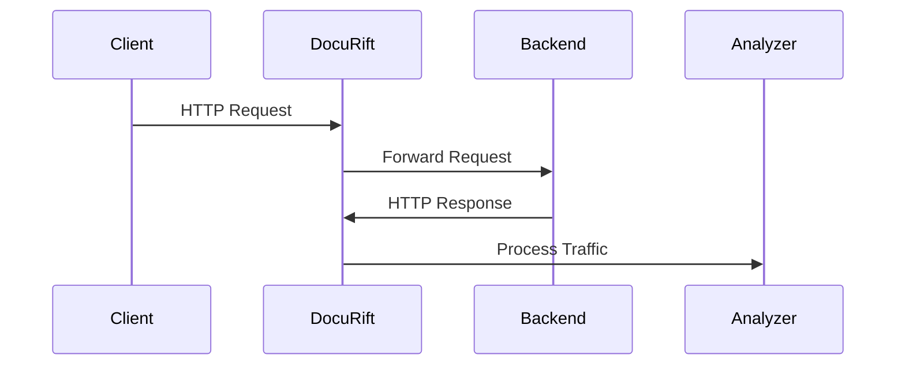

# DocuRift

DocuRift is a powerful tool that automatically generates and maintains REST API documentation by observing real API traffic. It acts as a proxy between your clients and API server, capturing and analyzing requests and responses to create comprehensive documentation.

This is particular useful for existing REST API service with live traffic but lack of documentation. Setup DocuRift as a proxy to run in front of your existing service and wait for a period of time, and come back to get your Open API spec and Postman Collection! 

This is safe to run in production environment as it does not send any data out, and masks sensitive user information by default. Analyzer and document generator runs asynchronously without additional performance penalty to your existing service!



## Features

- 🔄 **Real-time Documentation**: Automatically generates documentation from actual API usage
- 📝 **OpenAPI/Swagger Support**: Generates OpenAPI 3.0 specifications
- 📦 **Postman Collection**: Creates Postman collections for easy API testing
- 🔍 **Request/Response Examples**: Captures real examples of API usage
- 🛡️ **Security**: Handles sensitive data appropriately
- 📊 **Interactive UI**: Integrated Swagger UI for documentation browsing

## Installation

```bash
go install github.com/tienanr/docurift@latest
```

## Quick Start

1. Start DocuRift with your desired configuration:
```bash
docurift -proxy-port 9876 -analyzer-port 9877 -backend-url http://localhost:8080 -max-examples 20
```

2. Start your API server (example using the included shop API):
```bash
# Build and run the example API
cd examples/shop
go run shop.go
```
Confirm example shop services is running on port 8080

3. Make requests to your API through DocuRift:
```bash
go test ./examples/shop
```

4. Access your automatically generated documentation at `http://localhost:9877/` (Swagger UI)
You can also get open API spec: `http://localhost:9877/openapi.json`
And Postman Collection: `http://localhost:9877/postman.json`

## Configuration Options

- `-proxy-port`: Proxy server port (default: 9876)
- `-analyzer-port`: Analyzer server port (default: 9877)
- `-backend-url`: Backend API URL (default: http://localhost:8080)
- `-max-examples`: Maximum number of examples per endpoint (default: 10)

## Examples

Check out the `examples` directory for sample implementations:
- `examples/shop`: A complete e-commerce API with various endpoints

## Contributing

If you find any bugs or need more features please let me know!
Contributions are also welcome! Please feel free to submit a Pull Request.

## License

This project is licensed under the MIT License - see the LICENSE file for details. 