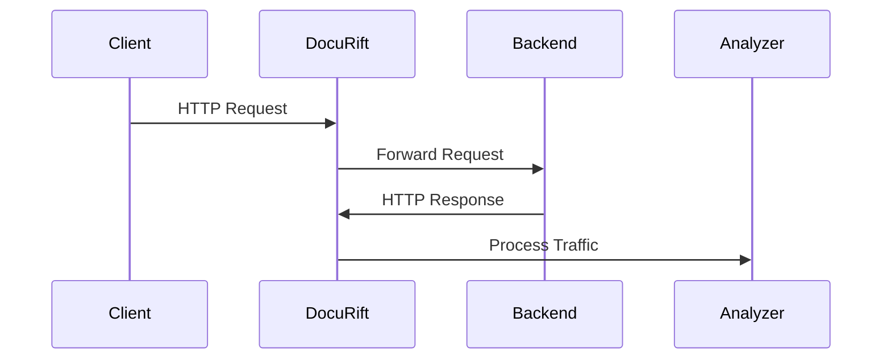

# DocuRift

DocuRift is a powerful tool that automatically generates and maintains REST API documentation by observing real API traffic. It acts as a proxy between your clients and API server, capturing and analyzing requests and responses to create comprehensive documentation.

This is particular useful for existing REST API service with live traffic but lack of documentation. Setup DocuRift as a proxy to run in front of your existing service and wait for a period of time, and come back to get your Open API spec and Postman Collection! 

This is safe to run in production environment as it does not send any data out, and masks sensitive user information by default. Analyzer and document generator runs asynchronously without additional performance penalty to your existing service!



## Features

- 🔄 **Real-time Documentation**: Automatically generates documentation from actual API usage
- 📝 **OpenAPI/Swagger Support**: Generates OpenAPI 3.0 specifications
- 📦 **Postman Collection**: Creates Postman collections for easy API testing
- 🔍 **Request/Response Examples**: Captures real examples of API usage
- 🛡️ **Security**: Handles sensitive data appropriately
- 📊 **Interactive UI**: Integrated Swagger UI for documentation browsing

## Installation

### Installing from Source Code

Clone, build and install into $GOBIN ($GOPATH/bin or $HOME/go/bin):

```bash
go install github.com/tienanr/docurift/cmd/docurift@latest
```

## Quick Start

1. Create a configuration file (e.g., `config.yaml`):
```yaml
proxy:
    port: 9876
    backend-url: http://localhost:8080

analyzer:
    port: 9877
    max-examples: 20
    redacted-fields:
        - password
```

2. Start DocuRift with your configuration:
```bash
docurift -config config.yaml
```

3. Start your API server (example using the included shop API) on port 8080 and send test traffic:
```bash
cd examples/shop
lsof -ti :8080 | xargs kill
go run shop.go &
sleep 3
go test -count=1 .
```

4. Access your automatically generated documentation at http://localhost:9877/ (Swagger UI)

5. Get open API spec: http://localhost:9877/openapi.json and Postman Collection: http://localhost:9877/postman.json

## Configuration

DocuRift uses a YAML configuration file to control its behavior. Here's the complete configuration reference:

### Proxy Section
- `port`: The port number that DocuRift's proxy server will listen on (e.g. 9876), point your clients request to this port instead of the real backend.
- `backend-url`: The URL of your backend service that DocuRift will forward requests to.

### Analyzer Section  
- `port`: The port number for DocuRift's analyzer API endpoint (e.g. 9877)
- `max-examples`: Maximum number of example values to store for each field in the schema
- `redacted-fields`: A list of fields to redact in the documentation. Their values will be shown as "REDACTED" (e.g. authorization headers, API keys, passwords). This applies globally to HTTP headers, URL parameters and JSON fields.


Example configuration:
```yaml
proxy:
    port: 9876
    backend-url: http://localhost:8080

analyzer:
    port: 9877
    max-examples: 10
```

## Examples

Check out the `examples` directory for sample implementations:
- `examples/shop`: A complete e-commerce API with various endpoints

## Contributing

If you find any bugs or need more features please let me know!
Contributions are also welcome! Please feel free to submit a Pull Request.

## License

This project is licensed under the MIT License - see the LICENSE file for details. 