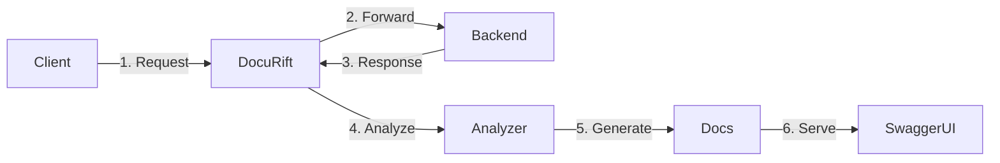
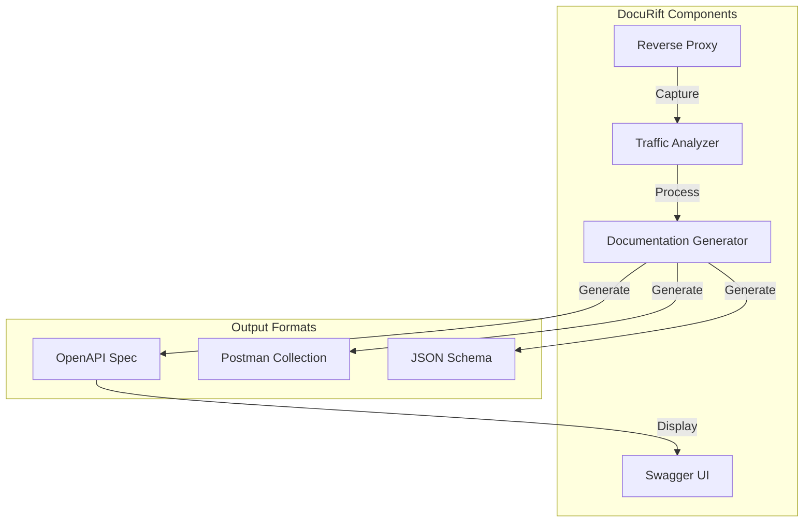
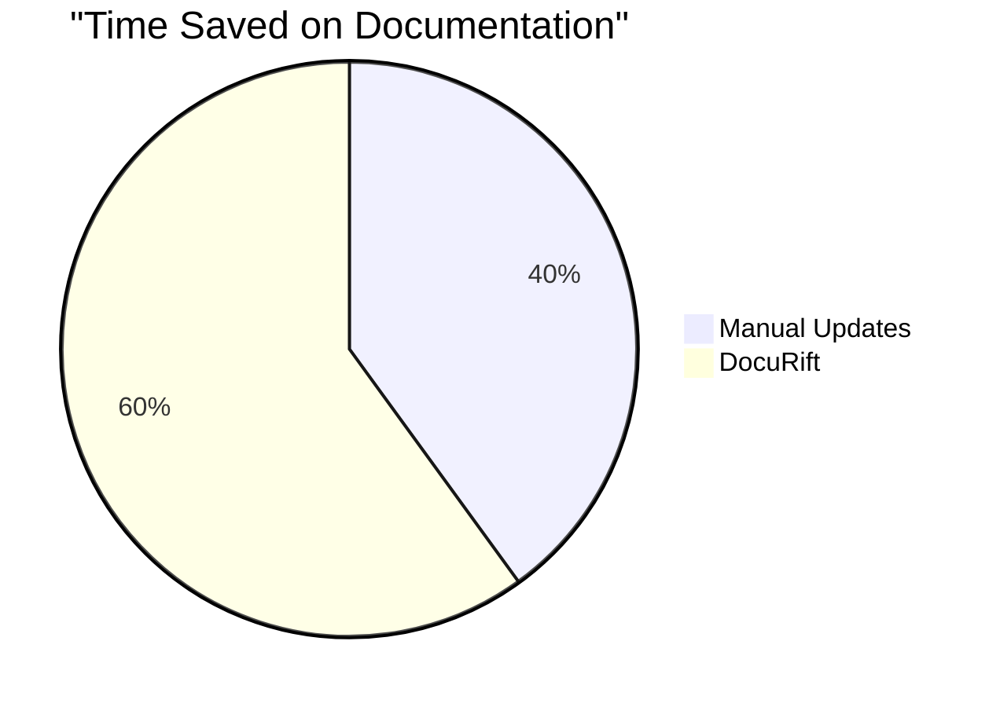
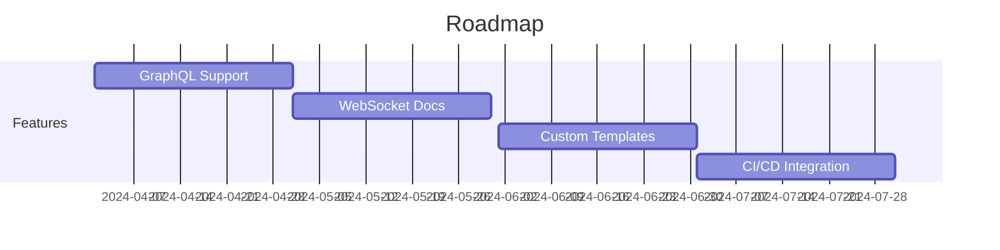

# DocuRift: Automatically Generate API Documentation from Real Traffic

## The Problem

As developers, we've all been there:
- Writing API documentation that quickly becomes outdated
- Manually updating OpenAPI/Swagger specs
- Struggling to keep Postman collections in sync
- Spending hours documenting endpoints that change frequently

What if there was a way to automatically generate and maintain API documentation by simply running your application?

## Introducing DocuRift

DocuRift is an open-source tool that automatically generates API documentation by analyzing real HTTP traffic. Here's how it works:



## Architecture Overview



## How It Works

DocuRift sits between your clients and your API server, acting as a reverse proxy. Here's the flow:

1. **Request Capture**
   ```mermaid
   sequenceDiagram
       participant Client
       participant DocuRift
       participant Backend
       participant Analyzer
       
       Client->>DocuRift: HTTP Request
       DocuRift->>Backend: Forward Request
       Backend->>DocuRift: HTTP Response
       DocuRift->>Analyzer: Process Traffic
   ```

2. **Analysis & Documentation**
   ```mermaid
   sequenceDiagram
       participant Analyzer
       participant Docs
       participant UI
       
       Analyzer->>Analyzer: Extract Patterns
       Analyzer->>Analyzer: Infer Schemas
       Analyzer->>Docs: Generate Specs
       Docs->>UI: Update Documentation
   ```

## Key Features

### 1. Zero Configuration Required
Just point DocuRift to your API server and it starts working. No manual documentation needed.

### 2. Multiple Output Formats
Generate documentation in multiple formats simultaneously:
- OpenAPI 3.0 specifications
- Postman collections
- Interactive Swagger UI
- Raw JSON schemas

### 3. Smart Analysis
- Automatically detects request/response patterns
- Infers data types and schemas
- Handles authentication headers
- Supports all HTTP methods

### 4. Developer-Friendly
- Written in Go for performance
- Easy to deploy
- Docker support
- Simple configuration

## Getting Started

1. Install DocuRift:
```bash
go install github.com/yourusername/docurift@latest
```

2. Configure your API server:
```yaml
proxy:
  port: 8080
  backend_url: "http://your-api:8081"

analyzer:
  port: 8082
  max_examples: 10
```

3. Run DocuRift:
```bash
docurift
```

4. Access your documentation at `http://localhost:8082/docs`

## Real-World Example

Here's how DocuRift documents a todo API:

```yaml
openapi: 3.0.0
info:
  title: Todo API
  version: 1.0.0
paths:
  /todos:
    get:
      summary: List todos
      responses:
        '200':
          content:
            application/json:
              schema:
                type: array
                items:
                  $ref: '#/components/schemas/Todo'
    post:
      summary: Create todo
      requestBody:
        content:
          application/json:
            schema:
              $ref: '#/components/schemas/Todo'
```

## Why DocuRift?



## Contributing

DocuRift is open source and welcomes contributions! Check out our [GitHub repository](https://github.com/yourusername/docurift) to:
- Report issues
- Submit pull requests
- Suggest features
- Join the community

## What's Next?



## Try It Now

Ready to automate your API documentation? Give DocuRift a try:

```bash
docker run -p 8080:8080 -p 8082:8082 yourusername/docurift
```

Let me know what you think! I'd love to hear your feedback and suggestions for improvement.

## Connect

- GitHub: [@yourusername](https://github.com/yourusername)
- Twitter: [@yourusername](https://twitter.com/yourusername)
- Website: [docurift.com](https://docurift.com) 